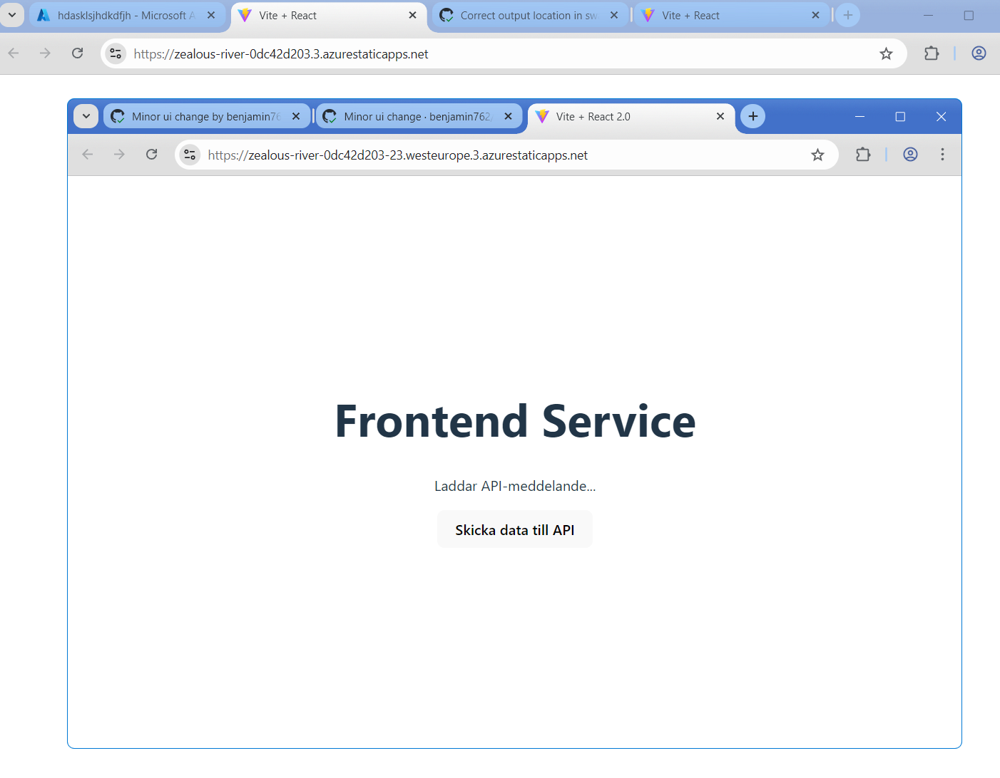

Automatisk API dokumentation på github pages:
https://benjamin762.github.io/compose-demo-project/

Den här dockerfilen är bättre än den föregående för att den bara installera beroenden som behöv i prod. Det ger mindre images och snabbare build då cache innehåller föregående lager som beror på färre saker än när man tar med alla dev deps så det ändras inte lika ofta.

Skärmdump av preview deployment

Permanent staging url: https://zealous-river-0dc42d203.3.azurestaticapps.net/
Den här länken ska delas med externa intressenter för att den kan uppdateras och den försvinner inte när nya pr skapar nya staging enviroments som försvinner när pr stängs.

Val av produktionsmiljö: \
SWA för att det är samma som dev staging och gick snabbt att sätta upp.
